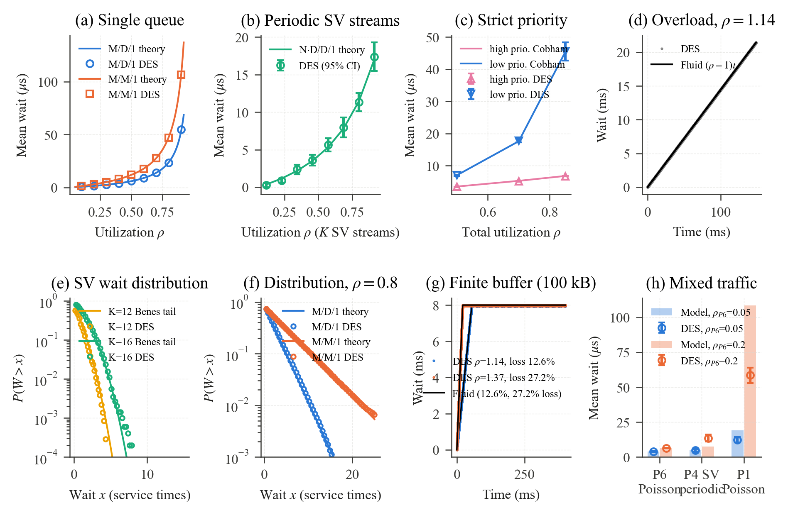

# Verification of the packet-level DES against queueing theory

This folder verifies the discrete-event simulator (DES) used in the paper
against closed-form queueing results. The harness imports the simulator's own
modules (`simulation_core.py`, `io_handler.py`) and runs its main loop
unchanged on a minimal topology: K sources and one sink on a single switch.
Only the traffic generation is replaced by synthetic arrival processes whose
solution is known. Every packet keeps the timestamps written by the simulator
(generation, switch input port, egress queue, sink), so the waiting time of
each queue is measured separately.

Simulator parameters are those of the paper: 100 Mbps links, 2 µs switch
processing, 149-byte SV frames (11.92 µs service time), 4 MB port buffers
(100 kB in case G to reach overflow quickly).

## How to run

```bash
# default: a clone of iec61850-network-simulator (tag v1.0-paper) next to this repository
export DES_SIMULATOR_DIR="/path/to/Simulador"
python validate_des.py          # cases A, B, C, D, E
python validate_extra.py F      # distributions
python validate_extra.py G      # finite buffer and loss
python validate_extra.py H      # mixed traffic vs. the analytic model of the paper
python validate_extra.py I      # priority with replications
python plot_validation.py       # results/fig_des_validation.png
```

Cases F-I can run in parallel. The full set takes about one hour on a laptop.

## Results



| Case | Reference | Result |
|---|---|---|
| E. Zero load | 2 serializations + 2 µs = 25.84 µs | 25.84 µs (exact) |
| A. Single Poisson source, fixed size | M/D/1 (Pollaczek-Khinchine) | within ±2.3 % for ρ = 0.2-0.9 |
| A. Single Poisson source, exponential size | M/M/1 | within ±4.8 % for ρ = 0.2-0.9 |
| B. K periodic SV streams, random phases | N·D/D/1 (Benes / Roberts-Virtamo), analytic model | all points within the 95 % CI (60 phase realizations each) |
| C/I. Two priority classes, 6 replications | Non-preemptive priority (Cobham) | high class −1 % to −3 %; low class within the 95 % CI |
| D. Overload, ρ = 1.144 | Fluid model, wait = (ρ−1)t | slope 0.14432 vs. 0.14432 |
| F. Wait distributions P(W > x) | Erlang (M/D/1), exponential (M/M/1), Benes tail (N·D/D/1) | max. absolute difference 0.007 (M/D/1, M/M/1), 0.013-0.035 (N·D/D/1) |
| G. Finite buffer, ρ = 1.14 and 1.37 | Fluid model: fill time 8B/(C(ρ−1)), plateau 8B/C, loss (ρ−1)/ρ | fill 55.1 vs. 55.4 ms and 21.4 vs. 21.4 ms; plateau 7.97 vs. 8.00 ms; loss 12.61 % vs. 12.61 % and 27.18 % vs. 27.18 % |
| H. Mixed traffic (8 SV streams at P4 + Poisson P6 and P1) | Analytic egress model of the paper (`analysis.egress_wait`) | see below |

### Notes

* **Zero waits (case F).** Frames that find the queue empty get a waiting time
  of the order of 1e-12 s instead of exactly zero, a floating-point residue of
  the timestamps. The distributions are therefore compared for x > 0.
* **Arrival smoothing (case C).** When the priority classes reach the egress
  port through 100 Mbps source links and the serial switch fabric, the frames
  are spaced and the DES waits are 7-14 % below Cobham's formula, which assumes
  Poisson arrivals. With 1 Gbps source links (near-Poisson arrivals at the
  100 Mbps egress port) the difference falls to 1-3 % (case I). This is a
  property of the traffic, not of the simulator.
* **Mixed traffic (case H).** The higher-priority Poisson class (P6) agrees
  within 3 %. The periodic SV class agrees within 2 % when the higher-priority
  load is small (ρ_P6 = 0.05), but the analytic model underestimates the SV wait
  by 39 % and 79 % when the higher-priority Poisson load is 0.1 and 0.2: the
  dilation factor 1/(1−σ) applied to the N·D/D/1 wait does not capture the
  interaction between periodic SV streams and random higher-priority traffic.
  In the case study of the paper the load above the SV class at the
  busbar-protection port is 0.0003 in steady state and reaches 0.055-0.068 only
  at the peak of an all-bay burst, which lasts a few milliseconds; the SV
  results of the paper therefore lie in the regime where the model is accurate. For the low-priority class (P1) the model
  overestimates the wait by 35-46 % because Cobham's formula treats the periodic
  SV load as Poisson; the model is conservative for that class.

| ρ_P6 | P6 Poisson (DES / model, µs) | P4 SV (DES / model, µs) | P1 Poisson (DES / model, µs) |
|---|---|---|---|
| 0.05 | 3.87 / 3.86 | 4.75 ± 1.03 / 4.68 | 12.4 / 19.0 |
| 0.10 | 5.02 / 5.12 | 8.31 ± 1.45 / 5.98 | 25.9 / 43.0 |
| 0.20 | 6.43 / 6.61 | 13.6 ± 2.45 / 7.58 | 58.5 / 108.6 |

## Files

* `validate_des.py` — harness and cases A-E
* `validate_extra.py` — cases F-I
* `c_fast.py` — case C with 1 Gbps source links (single replication)
* `plot_validation.py` — figure
* `results/` — CSV files with every compared value and the figure
